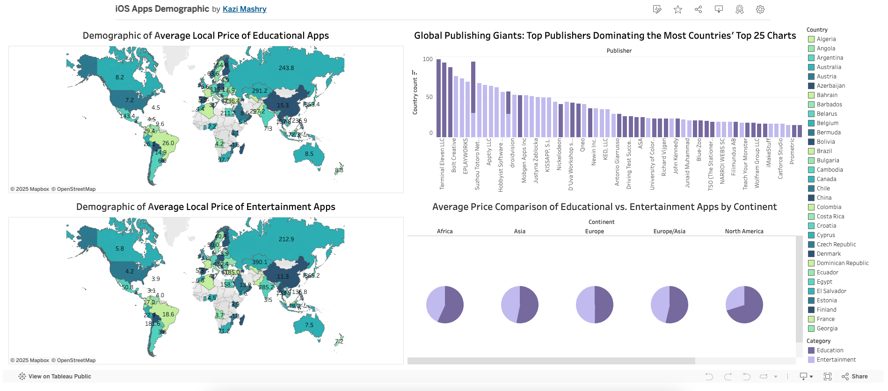

# AppsComparison
## Website
[Sensor Tower - Top Charts](https://app.sensortower.com/top-charts?os=ios&category=0&country=US&date=2025-01-20&device=iphone)

## Background
The above-mentioned website provides the top 75 iOS apps in the USA for a given date. These 75 apps are categorized into **Free**, **Paid**, and **Top Grossing**. By changing the `country` parameter in the URL, you can retrieve the corresponding top iOS apps for other countries.

## Project Idea
This project will:
- Scrape the website to grab the top **Paid apps** from all available countries (approximately 100 countries).
- Focus on the **Entertainment** and **Education** categories.
- Collect data for the **last two days of 2024**.

This project will involve:
- Extracting data from the website for each country.
- Filtering and processing the data to only include apps from the specified categories.
- Presenting the findings in a meaningful and organized format.

## Goals
- Build a web scraper for dynamic data extraction.
- Analyze trends in **Entertainment** and **Education** apps.
- Gain insights into app popularity across countries.

## Build From Source
1. Clone repo
```bash
git clone https://github.com/SysCall97/AppsComparison.git
```
2. Initialize virtual environment
```bash
virtualenv venv  
```
3. Activate virtual environment
```bash
source ./venv/bin/activate
```
4. Install dependencies
```bash
pip install -r requirements.txt
```
5. First run ``app_data_scrapping.ipynb`` file for scrapping data
6. Since there are a lot of data to scrap and we have to reload the website several times, so it's highly possible that the site might stop from loading. In this case we have to scrap data by chunk of 10 countries, save them into separate csv file, then merge.
7. Following above technique, we'll get 1_10.csv, 2_10.csv upto 10_10.csv. 
8. Then we'll merge and get the final dataset by running ``data_transformation.ipynb`` file

## Dashboard Preview


> **Click the image to view the interactive dashboard.**
[View Interactive Dashboard](https://public.tableau.com/app/profile/kazi.mashry/viz/iOSAppsDemographic/Dashboard1?publish=yes)
